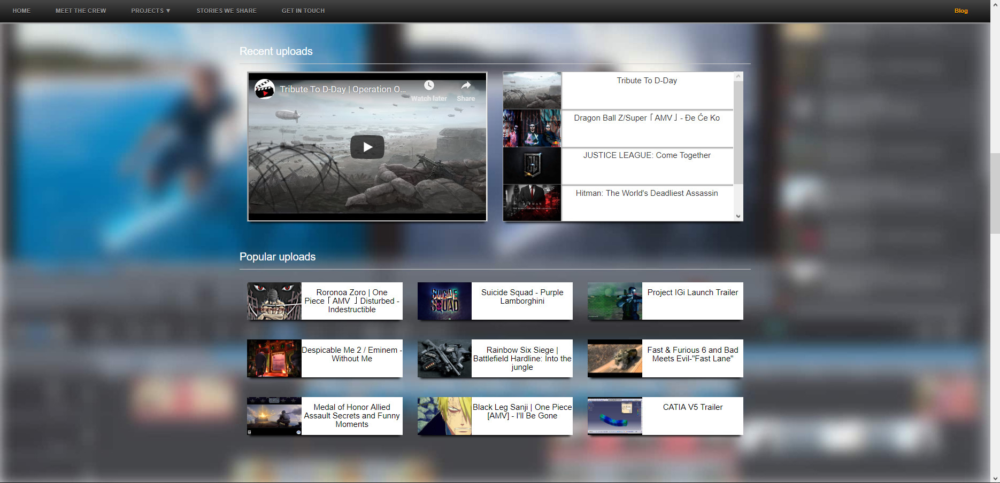

### **Next Crew Production official website**

Next Crew Production website is a sample of fully responsive website. It's built on technologies like Bootstrap, Sass, EcmaScript6, Jquery, Node, Express, GulpJS and features elements like overlays, sliders, iframes, snackbars etc. Project receives new updates from time to time. Here's a preview of the website running on [Heroku](https://nextcrewproduction.herokuapp.com/).

#### *About production*
##### Next Crew Production produces high quality content for youtube audience. Next Crew does everything from mixing music to video editing and creating custom wallpapers. Some of the tools they use: 
* Sony Vegas Pro 
* Adobe Photoshop
* Virtual DJ
* Windows Movie Maker
* BeFunky

> Official youtube channels: [Nonyx](https://www.youtube.com/user/Nonyx100) & [Spy4er](https://www.youtube.com/channel/UCpAHpJDwziiBf560y8pOcaA)
